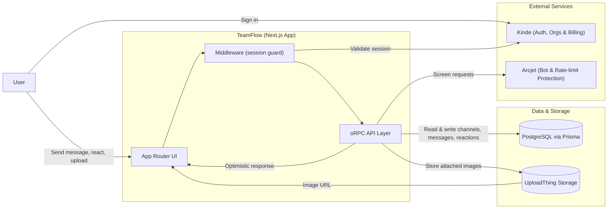

# TeamFlow

> Real-time team messaging platform with workspaces, channels, threads and reactions, inspired by tools like Slack.

    

TeamFlow is a full-stack, multi-tenant team communication platform built with Next.js 16 (App Router), React 19 and TypeScript. Teams can create workspaces, organize conversations into channels, write rich-formatted messages with a Tiptap-based editor, attach images, react with emoji, and keep discussions organized through threaded replies.

## Features

- Multi-tenant workspaces backed by Kinde organizations, with member invites
- Channel-based messaging, with a persistent channel sidebar per workspace
- Rich text message composer (Tiptap) with formatting and code blocks
- Image uploads attached to messages, powered by UploadThing
- Threaded replies with reply counts shown in the main channel view
- Emoji reactions on messages and thread replies, with optimistic UI updates
- Message editing after send
- Reverse infinite scroll for browsing message history
- Light/dark theme support
- Bot and abuse protection via Arcjet at the API layer
- Type-safe API layer built with oRPC and Zod, consumed through TanStack Query

## Tech stack

| Layer | Technology |
| --- | --- |
| Framework | Next.js 16 (App Router), React 19, TypeScript |
| Styling / UI | Tailwind CSS 4, Radix UI, shadcn-style component library |
| API layer | oRPC (type-safe RPC) + TanStack Query |
| Database | PostgreSQL with Prisma ORM |
| Auth & billing | Kinde (authentication, organizations, billing) |
| Security | Arcjet (bot detection & rate limiting) |
| File uploads | UploadThing |
| Rich text editor | Tiptap |
| Emoji picker | Frimousse |
| Forms & validation | React Hook Form + Zod |

## Architecture & flow



1. The user signs in through Kinde, which manages authentication and workspace-level organizations.
2. Requests hitting protected routes pass through Next.js middleware, which validates the session before allowing access to a workspace.
3. All data operations (creating channels, sending messages, editing, reacting, inviting members) go through a type-safe oRPC API layer, validated with Zod schemas.
4. Every API request is screened by Arcjet for bot activity and rate limiting before touching the database.
5. Messages, channels, threads and reactions are persisted in PostgreSQL via Prisma; image attachments are uploaded to UploadThing and referenced by URL.
6. The client uses TanStack Query with optimistic updates, so actions like sending a message or reacting with an emoji feel instant while the server confirms them in the background.

## Project structure

```
app/
├── (dashboard)/workspace/[workspaceId]/
│   ├── channel/[channelId]/       # Channel view: messages, threads, reactions
│   └── _components/                # Workspace-level UI (sidebar, switcher, etc.)
├── (marketing)/                     # Public landing page
├── api/                              # Route handlers (e.g. UploadThing callback)
├── middlewares/                     # Auth/session middleware
├── router/                          # oRPC routers: channel, member, message, workspace
├── rpc/[[...rest]]/                 # oRPC HTTP handler
└── schemas/                          # Zod schemas shared by routers and forms
components/
├── general/                         # Shared app components
├── rich-text-editor/                # Tiptap-based message composer
└── ui/                              # shadcn/Radix-based UI primitives
hooks/                                # Custom React hooks
lib/
├── arcjet.ts                        # Arcjet security configuration
├── db.ts                            # Prisma client
├── orpc.ts / orpc.server.ts         # oRPC client & server setup
├── uploadthing.ts                   # UploadThing configuration
└── query/                           # TanStack Query setup
prisma/
└── schema.prisma                    # Database schema
providers/                            # App-wide React context providers
```

## Data model (simplified)

- **Channel** — belongs to a workspace (Kinde organization), has a unique name per workspace, and contains many messages.
- **Message** — belongs to a channel, optionally attaches an image, and can be a reply to another message via a self-relation (threads); stores author metadata for fast rendering.
- **MessageReaction** — an emoji reaction on a message, uniquely constrained per user/message/emoji combination.

## Getting started

### Prerequisites

- Node.js 18+
- pnpm (the project uses a `pnpm-lock.yaml`)
- A PostgreSQL database
- Accounts for Kinde, UploadThing and Arcjet (for auth, uploads and security respectively)

### Environment variables

This project requires credentials for the database, Kinde authentication, UploadThing and Arcjet integrations. Create a local `.env` file with your own values (never commit it or share real credentials) before running the app.

### Installation

```bash
pnpm install
pnpm dev
```

Open [http://localhost:3000](http://localhost:3000) to see the app.

## Available scripts

| Script | Description |
| --- | --- |
| `dev` | Starts the development server |
| `build` | Builds the app for production |
| `start` | Runs the production build |
| `lint` | Runs ESLint |

## Deployment

The easiest way to deploy this app is with [Vercel](https://vercel.com), the platform built by the creators of Next.js. Make sure all required environment variables are configured in your deployment environment before deploying.

## License

Specify a license here (e.g. MIT) if you want the project to be reusable by others.
